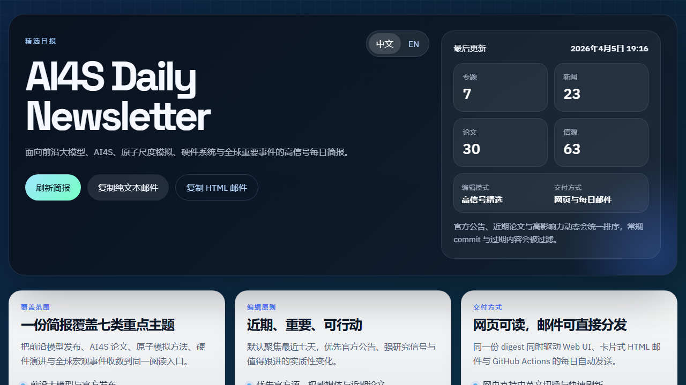

# AI4S Daily Newsletter

AI4S Daily Newsletter is a curated daily brief for frontier models, AI4S, atomistic simulation, hardware systems, and globally important developments. It combines a bilingual web interface, a card-based HTML email, and scheduled delivery through GitHub Actions.

## Preview



The preview uses the English view for consistency with this README. The web UI itself supports both English and Chinese with the same topic structure and email workflow.
To refresh this screenshot after UI changes, run `npm run readme:preview`.

## What It Covers

- Frontier model launches and official product updates
- AI4S, scientific machine learning, and agent workflows
- LAMs, PFD, DFT, LAMMPS, ABACUS, and atomistic computing
- Hardware acceleration, memory systems, FPGA/ASIC, and systems shifts
- Magnetic materials and related materials science signals
- A global watchlist across finance, technology, politics, defense, and macro risk

## Editorial Principles

- Recent first: the default window is the last seven days, with stronger preference for the last 24 to 72 hours
- High-signal selection: the pipeline favors official announcements, strong papers, major releases, benchmarks, performance and scaling milestones, and material method changes
- Low-noise filtering: routine commits, minor version churn, generic marketing posts, and stale items are filtered out
- Topic framing: each topic includes `importance`, `confidence`, `why-it-matters`, and `next-step` analysis before the link list
- Analysis fallback: topic framing can come from a local analysis bundle, an optional remote structured-analysis service, or the built-in template fallback

## Product Surfaces

### Web UI

The web UI is designed as a readable publication page rather than an internal dashboard:

- bilingual Chinese / English switch
- topic cards with analysis blocks and link cards
- curated overview panels for coverage, editorial policy, and delivery
- clipboard actions for text email and HTML email

### Email

The generated email includes:

- a styled hero section
- topic-by-topic cards
- HTML link cards instead of plain link dumps
- plain-text fallback for clients that do not render HTML

### Automation

GitHub Actions is the production delivery path. It runs the digest daily and sends it through Gmail SMTP to the configured recipient.

## Sources

Current coverage mixes official feeds, high-quality media, arXiv, and a small set of specialized atomistic sources.

Examples include:

- OpenAI, Anthropic, Google AI, Google Developers / Gemma, Google DeepMind
- Mistral, Meta Llama, xAI, Hugging Face official release streams
- NVIDIA, The Verge, TechCrunch, VentureBeat, CNBC, NPR, POLITICO, WSJ, MarketWatch, Sky News, UN News, Defense News, Defense One
- DeepModeling ABACUS news, official LAMMPS releases, Materials Project database versions, OQMD releases, Psi-k announcements
- arXiv for paper discovery

## Local Development

### Requirements

- Node.js `22.x`

### Install

```bash
npm install
```

### Run the web app

```bash
npm run dev
```

Open [http://localhost:3000](http://localhost:3000).

### Production start

```bash
npm start
```

The production server exposes:

- `/` for the web UI
- `/api/digest` for the structured digest payload
- `/api/digest/email` for the generated email payload
- `/healthz` for health checks

### Generate a local analysis brief

```bash
npm run digest:analysis:brief
```

This writes a compact JSON briefing to `var/editorial-analysis/briefing.json` with:

- the day's filtered topic signals
- editorial priors for each topic
- the exact JSON shape expected by the local analysis workflow
- the output path for the validated analysis file

### Apply a local analysis bundle

```bash
npm run digest:analysis:apply
```

By default this reads `var/editorial-analysis/candidate.json`, validates it, and saves the normalized result to `var/editorial-analysis/latest.json`.

You can also provide a custom input file:

```bash
node scripts/apply-analysis-bundle.mjs --input path/to/analysis.json
```

### Generate the email payload

```bash
npm run digest:email
```

This prints JSON with:

- `subject`
- `plainText`
- `html`

### Send a real email locally

```bash
GMAIL_SMTP_USER="your@gmail.com" \
GMAIL_SMTP_PASS="your-app-password" \
DIGEST_TO_EMAIL="recipient@example.com" \
npm run digest:send
```

### Dry run email send

```bash
GMAIL_SMTP_USER="your@gmail.com" \
GMAIL_SMTP_PASS="your-app-password" \
DIGEST_TO_EMAIL="recipient@example.com" \
DIGEST_DRY_RUN=1 \
npm run digest:send
```

## Environment Variables

Required for real email sending:

- `GMAIL_SMTP_USER`
- `GMAIL_SMTP_PASS`
- `DIGEST_TO_EMAIL`

Optional:

- `GMAIL_SMTP_HOST` defaults to `smtp.gmail.com`
- `GMAIL_SMTP_PORT` defaults to `465`
- `DIGEST_FROM_EMAIL` defaults to `GMAIL_SMTP_USER`
- `DIGEST_LOCALE` set to `zh` or `en`
- `DIGEST_ANALYSIS_MODE` set to `hybrid`, `local`, `remote`, or `template` and defaults to `hybrid`
- `LOCAL_ANALYSIS_FILE` defaults to `var/editorial-analysis/latest.json`
- `LOCAL_ANALYSIS_CANDIDATE_FILE` defaults to `var/editorial-analysis/candidate.json`
- `LOCAL_ANALYSIS_BRIEFING_FILE` defaults to `var/editorial-analysis/briefing.json`
- `LOCAL_ANALYSIS_MAX_AGE_HOURS` defaults to `30`
- `REMOTE_ANALYSIS_API_KEY` enables optional remote structured analysis when the mode allows it
- `REMOTE_ANALYSIS_MODEL` selects the remote model or endpoint variant
- `REMOTE_ANALYSIS_TIMEOUT_MS` defaults to `45000`
- `REMOTE_ANALYSIS_BASE_URL` points to the remote structured-analysis API

### Analysis mode behavior

- `template`: always use the built-in rule-based analysis
- `local`: use the local analysis file if it is current, otherwise fall back to template
- `remote`: use the remote structured-analysis service when configured, otherwise fall back to template
- `hybrid`: prefer the local analysis file, then the remote structured-analysis service if configured, then template

## Local Analysis Workflow

The local analysis path is designed for desktop automation rather than an in-process dependency.

Typical flow:

1. Run `npm run digest:analysis:brief`
2. Read `var/editorial-analysis/briefing.json`
3. Write a JSON analysis bundle to `var/editorial-analysis/candidate.json`
4. Run `npm run digest:analysis:apply`
5. Run `npm run digest:send`

The JSON analysis bundle should include:

- `generatedAt`
- `digestDateKey`
- `topics`

Each topic entry should include:

- `id`
- `importanceLevel`
- `confidenceLevel`
- `importanceTextEn`
- `importanceTextZh`
- `confidenceTextEn`
- `confidenceTextZh`
- `whyItMattersEn`
- `whyItMattersZh`
- `nextStepTextEn`
- `nextStepTextZh`
- `actionsEn`
- `actionsZh`

`hybrid` mode is the recommended default: if the local analysis file is missing, stale, or invalid, the digest still renders using template analysis instead of failing.

## Deploy on Vercel

This repository now supports Vercel deployment without changing the user-facing routes:

- `public/` serves the web UI
- `api/digest/index.js` serves `/api/digest`
- `api/digest/email.js` serves `/api/digest/email`
- `api/healthz.js` serves `/healthz` through [vercel.json](vercel.json)

Recommended Vercel setup:

1. Import the GitHub repository into Vercel
2. Keep the root directory as the repository root
3. Let Vercel detect the project as `Other`
4. Deploy with the existing [vercel.json](vercel.json) and [package.json](package.json)

Recommended environment variables for the hosted site:

- none are required for the default deployment
- do not add `TZ` on Vercel; that name is reserved
- keep the hosted site on the default template-based behavior unless you intentionally want remote analysis on the public site

The hosted Vercel site is best used for the public web experience. Scheduled email delivery should remain in GitHub Actions.

## Deploy on Render

This repository includes [render.yaml](render.yaml), so Render can import it as a Blueprint with the expected build, start, and health-check settings.

Recommended split:

- use Render for the public web application
- keep scheduled email sending in GitHub Actions

That keeps the web UI online without moving SMTP delivery into the hosted web process.

### Render deployment steps

1. Push the branch you want to deploy to GitHub.
2. In Render, choose **New +** -> **Blueprint**.
3. Select the repository you want to deploy.
4. Review the detected `render.yaml` configuration.
5. Create the web service and wait for the first build to finish.

### Blueprint defaults

The included Blueprint config uses:

- `plan: free`
- `buildCommand: npm ci`
- `startCommand: npm start`
- `healthCheckPath: /healthz`
- `NODE_VERSION=22`
- `TZ=Asia/Shanghai`
- `DIGEST_ANALYSIS_MODE=template`

### Optional Render environment variables

The site can run without SMTP credentials.

Only add these if you want a different analysis mode on the hosted site:

- `DIGEST_ANALYSIS_MODE`
- `REMOTE_ANALYSIS_API_KEY`
- `REMOTE_ANALYSIS_MODEL`
- `REMOTE_ANALYSIS_BASE_URL`
- `REMOTE_ANALYSIS_TIMEOUT_MS`

If you keep the default `template` mode, the public site works without extra secrets.

## GitHub Actions

The production workflow lives at `.github/workflows/daily-digest.yml`.

It supports:

- scheduled runs
- manual runs with `workflow_dispatch`

### Schedule

The workflow uses:

```text
0 0 * * *
```

GitHub Actions cron is UTC, so this maps to:

- `UTC 00:00`
- `Asia/Shanghai 08:00`

### Required GitHub Secrets

- `GMAIL_SMTP_USER`
- `GMAIL_SMTP_PASS`

### Required GitHub Variables

- `DIGEST_TO_EMAIL`

Recommended:

- `GMAIL_SMTP_HOST=smtp.gmail.com`
- `GMAIL_SMTP_PORT=465`
- `DIGEST_FROM_EMAIL`
- `REMOTE_ANALYSIS_API_KEY`
- `REMOTE_ANALYSIS_MODEL`
- `REMOTE_ANALYSIS_BASE_URL`

The target recipient is configured through the repository variable `DIGEST_TO_EMAIL`.

## Gmail App Password

`GMAIL_SMTP_PASS` must be a Gmail App Password, not the normal account password.

Steps:

1. Enable 2-Step Verification on the Google account
2. Open [Google App Passwords](https://myaccount.google.com/apppasswords)
3. Create a new app password for Mail
4. Store the generated 16-character password in the GitHub Actions secret `GMAIL_SMTP_PASS`

## Project Structure

```text
public/
  index.html          Web UI shell
  app.js              Client-side rendering and locale switching
  styles.css          Visual design

api/
  digest/index.js     Vercel digest endpoint
  digest/email.js     Vercel email endpoint
  healthz.js          Vercel health endpoint

scripts/
  export-analysis-brief.mjs  Build the compact topic briefing
  apply-analysis-bundle.mjs  Validate and store local analysis JSON
  generate-email.mjs         Build subject / text / html payload
  send-email.mjs             Send the email over Gmail SMTP
  capture-readme-preview.mjs Refresh the README screenshot

src/
  config/topics.js    Topics, source metadata, editorial hints
  lib/digest.js       Fetching, filtering, ranking, rendering

server.js             Express server and API routes
vercel.json           Vercel deployment settings
render.yaml           Render blueprint settings
```

## API

- `GET /api/digest`
  Returns the structured digest for the web UI.

- `GET /api/digest?refresh=1`
  Forces a fresh rebuild instead of using cache.

- `GET /api/digest/email`
  Returns the generated email payload.

- `GET /api/digest/email?locale=en`
  Returns the English email payload.

## Positioning

This project is intentionally opinionated:

- it is not a generic RSS reader
- it is not a commit firehose
- it is not a long-form knowledge base

It is a compact, high-signal publication layer for daily monitoring and fast decision support.
